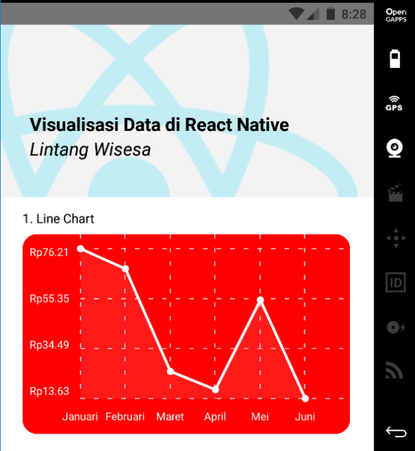
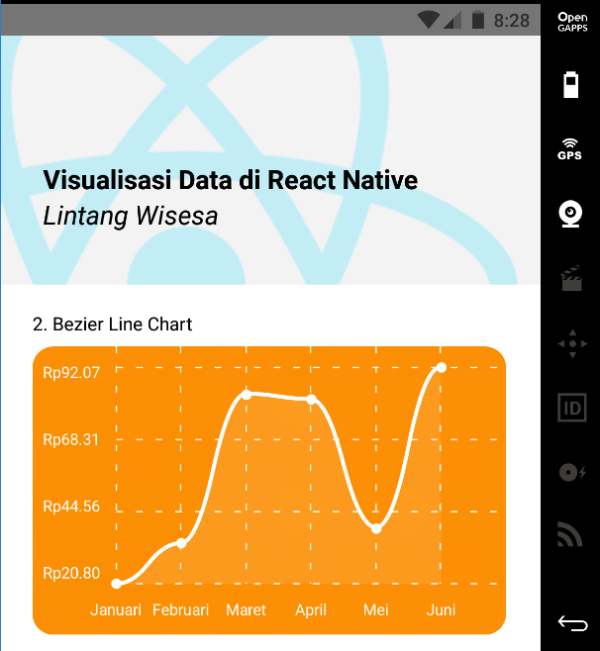
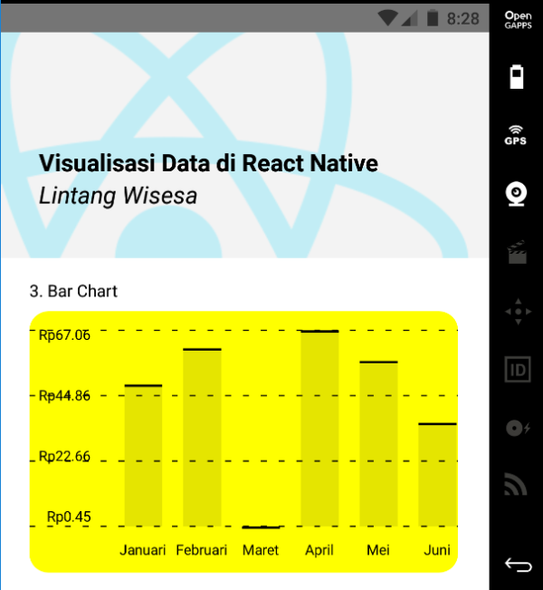
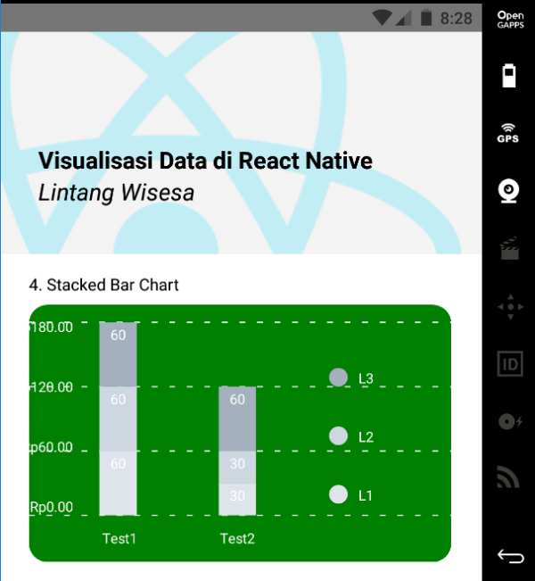
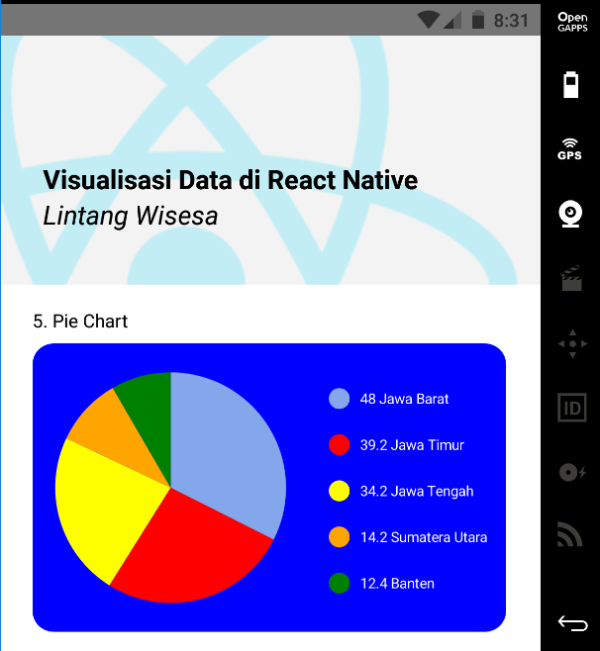

# Data Visualization using React Native & Chart Kit

1. Create a React Native project (I'm using the latest __*RN 0.61.2*__ and __*Genymotion*__ as Android emulator), then install __*react-native-chart-kit*__ and __*react-native-svg*__ package.

    ```bash
    $ npm i react-native-chart-kit react-native-svg
    ```

    Then follow these codes below to create several charts on your React Native application:

1. Create a __Line Chart__

    

    ```javascript
    <LineChart
        data={{
        labels: ["Januari", "Februari", "Maret", "April", "Mei", "Juni"],
        datasets: [
            {
            data: [
                Math.random() * 100,
                Math.random() * 100,
                Math.random() * 100,
                Math.random() * 100,
                Math.random() * 100,
                Math.random() * 100
            ]
            }
        ]
        }}
        width={Dimensions.get("window").width - 50} // from react-native
        height={220}
        yAxisLabel={"Rp"}
        chartConfig={{
        backgroundColor: "red",
        backgroundGradientFrom: "red",
        backgroundGradientTo: "red",
        decimalPlaces: 2, // optional, defaults to 2dp
        color: (opacity = 1) => `white`,
        labelColor: (opacity = 1) => `white`,
        style: {
            borderRadius: 16
        }
        }}
        style={{
        marginVertical: 8,
        borderRadius: 16
        }}
    />
    ```

1. Create a __Bezier Line Chart__

    

    ```javascript
    <LineChart
        data={{
        labels: ["Januari", "Februari", "Maret", "April", "Mei", "Juni"],
        datasets: [
            {
            data: [
                Math.random() * 100,
                Math.random() * 100,
                Math.random() * 100,
                Math.random() * 100,
                Math.random() * 100,
                Math.random() * 100
            ]
            }
        ]
        }}
        width={Dimensions.get("window").width - 50} // from react-native
        height={220}
        yAxisLabel={"Rp"}
        chartConfig={{
        backgroundColor: "#e26a00",
        backgroundGradientFrom: "#fb8c00",
        backgroundGradientTo: "#ffa726",
        decimalPlaces: 2, // optional, defaults to 2dp
        color: (opacity = 1) => `white`,
        labelColor: (opacity = 1) => `white`,
        style: {
            borderRadius: 16
        }
        }}
        bezier
        style={{
        marginVertical: 8,
        borderRadius: 16
        }}
    />
    ```

1. Create a __Bar Chart__

    

    ```javascript
    <BarChart
        data={{
        labels: ["Januari", "Februari", "Maret", "April", "Mei", "Juni"],
        datasets: [
            {
            data: [
                Math.random() * 100,
                Math.random() * 100,
                Math.random() * 100,
                Math.random() * 100,
                Math.random() * 100,
                Math.random() * 100
            ]
            }
        ]
        }}
        width={Dimensions.get("window").width - 50} // from react-native
        height={220}
        yAxisLabel={"Rp"}
        chartConfig={{
        backgroundColor: "yellow",
        backgroundGradientFrom: "yellow",
        backgroundGradientTo: "yellow",
        decimalPlaces: 2, // optional, defaults to 2dp
        color: (opacity = 1) => `black`,
        labelColor: (opacity = 1) => `black`,
        barPercentage:1,
        style: {
            borderRadius: 16
        }
        }}
        style={{
        marginVertical: 8,
        borderRadius: 16
        }}
    />
    ```

2. Create a __Stacked Bar Chart__

    

    ```javascript
    <StackedBarChart
        data={{
            labels: ["Test1", "Test2"],
            legend: ["L1", "L2", "L3"],
            data: [[60, 60, 60], [30, 30, 60]],
            barColors: ["#dfe4ea", "#ced6e0", "#a4b0be"]
        }}
        width={Dimensions.get("window").width - 50} // from react-native
        height={220}
        yAxisLabel={"Rp"}
        chartConfig={{
        backgroundColor: "green",
        backgroundGradientFrom: "green",
        backgroundGradientTo: "green",
        decimalPlaces: 2, // optional, defaults to 2dp
        color: (opacity = 1) => `white`,
        labelColor: (opacity = 1) => `white`,
        style: {
            borderRadius: 16
        }
        }}
        style={{
        marginVertical: 8,
        borderRadius: 16
        }}
    />
    ```

2. Create a __Pie Chart__

    

    ```javascript
    <PieChart
        data={
            [
            {
                name: "Jawa Barat",
                population: 48.0,
                color: "rgba(131, 167, 234, 1)",
                legendFontColor: "white",
                legendFontSize: 11
            },
            {
                name: "Jawa Timur",
                population: 39.2,
                color: "red",
                legendFontColor: "white",
                legendFontSize: 11
            },
            {
                name: "Jawa Tengah",
                population: 34.2,
                color: "yellow",
                legendFontColor: "white",
                legendFontSize: 11
            },
            {
                name: "Sumatera Utara",
                population: 14.2,
                color: "orange",
                legendFontColor: "white",
                legendFontSize: 11
            },
            {
                name: "Banten",
                population: 12.4,
                color: "green",
                legendFontColor: "white",
                legendFontSize: 11
            }
            ]
        }
        width={Dimensions.get("window").width - 50} // from react-native
        height={220}
        chartConfig={{
            color: (opacity = 1) => `white`,
            labelColor: (opacity = 1) => `white`,
            style: {
                borderRadius: 16
            }
        }}
        backgroundColor="blue"
        accessor="population"
        paddingLeft="15"
        absolute
        style={{
            marginVertical: 8,
            borderRadius: 16
        }}
    />
    ```

#

#### Lintang Wisesa :love_letter: _lintangwisesa@ymail.com_

[Facebook](https://www.facebook.com/lintangbagus) | 
[Twitter](https://twitter.com/Lintang_Wisesa) |
[Google+](https://plus.google.com/u/0/+LintangWisesa1) |
[Youtube](https://www.youtube.com/user/lintangbagus) | 
:octocat: [GitHub](https://github.com/LintangWisesa) |
[Hackster](https://www.hackster.io/lintangwisesa)